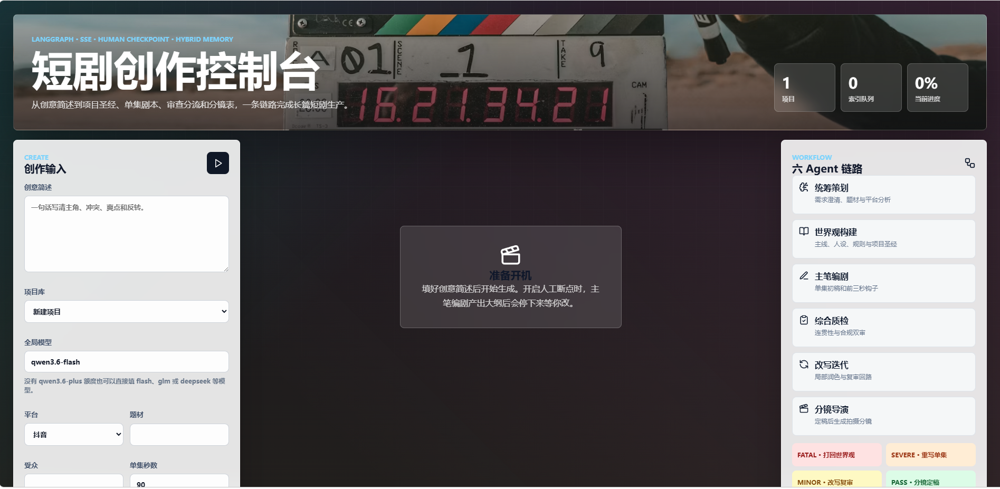
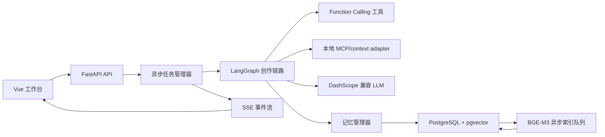
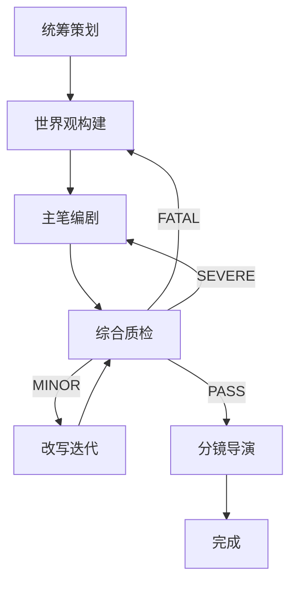

# 短剧剧本创作 Agent

一个面向短剧/短视频剧本生产的多 Agent Demo。系统从创意简述出发，自动完成项目圣经、单集剧本、审查改写、拍摄分镜和多集记忆检索，并提供可编辑的前端工作台。


## 技术栈

- 后端：FastAPI、LangGraph、SQLAlchemy、uv
- 前端：Vue 3、Vite、lucide-vue-next
- LLM：阿里百炼 DashScope OpenAI-compatible API
- 编排：LangGraph 条件路由 + 可选人工断点
- 记忆：PostgreSQL + pgvector，BGE-M3 本地 embedding，异步索引队列
- 检索：向量召回 + 关键词召回 + RRF 融合
- 导出：python-docx 生成 Word，reportlab 生成 PDF

## 核心能力

- 六 Agent 创作链路：统筹策划、世界观构建、主笔编剧、综合质检、改写迭代、分镜导演
- LangGraph 审改分流：`FATAL` 打回世界观，`SEVERE` 打回单集剧本，`MINOR` 改写复审，`PASS` 进入分镜
- SSE 流式任务：后端异步生成，前端以打字机形式接收进度、日志和片段文本
- 人机协同断点：可在大纲/初稿生成后暂停，用户修改后继续后续 Agent
- 模型路由：支持全局模型，也支持每个 Agent 独立选择模型和工具/模型/混合模式
- 项目库：保存项目、剧集版本，支持继续生成下一集、删除项目、删除剧集
- 长篇记忆：保存版本后拆分为知识块，后台异步写入 BGE-M3 embedding，生成续集时做混合检索
- 剧本编辑器：编辑剧名、钩子、场景、台词、分镜表，并支持局部改写、压缩时长和重建分镜
- 导出：下载 Word / PDF，后端只保留临时文件，响应结束后自动删除

## 架构概览



## Agent 流程



## 快速启动

### 1. 启动 PostgreSQL + pgvector

```bash
docker compose up -d postgres
```


### 2. 启动后端

```bash
cd backend
uv sync --extra local-embedding
copy .env.example .env
uv run uvicorn app.main:app --reload --host 127.0.0.1 --port 8001
```

`.env.example` 默认使用 mock LLM + 本地 BGE-M3：

```env
USE_MOCK_LLM=true
EMBEDDING_PROVIDER=local
LOCAL_EMBEDDING_MODEL=BAAI/bge-m3
LOCAL_EMBEDDING_DEVICE=auto
EMBEDDING_DIMENSION=1024
STORAGE_BACKEND=auto
ENABLE_VECTOR_MEMORY=true
```

要调用真实百炼模型，把 `USE_MOCK_LLM=false`，并填写 `DASHSCOPE_API_KEY`。不要把本地 `.env` 提交到仓库。前端可以直接输入任意 DashScope OpenAI-compatible 模型 ID。

### 3. 启动前端

```bash
cd frontend
npm.cmd install
npm.cmd run dev
```

打开 `http://127.0.0.1:5173`。Vite 会把 `/api` 代理到后端服务。

## 常用接口

- `POST /api/scripts/jobs`：提交异步生成任务
- `GET /api/scripts/jobs/{job_id}`：查询任务状态
- `GET /api/scripts/jobs/{job_id}/events`：SSE 流式事件
- `POST /api/scripts/jobs/{job_id}/resume`：人工断点后继续
- `GET /api/projects`：项目库
- `DELETE /api/projects/{project_id}`：删除项目
- `DELETE /api/projects/{project_id}/versions/{version_id}`：删除剧集版本
- `GET /api/models`：模型预设和 Agent 默认路由
- `GET /api/capabilities`：工具、MCP、记忆和工作流说明
- `GET /api/memory/indexer`：BGE-M3 索引队列状态
- `POST /api/scripts/export/docx`：导出 Word
- `POST /api/scripts/export/pdf`：导出 PDF

## 测试

测试默认使用 mock/json 模式，不依赖真实 API key、Docker 或本地 embedding 模型。

```bash
cd backend
uv run pytest
```

当前 smoke tests 覆盖：

- 健康检查、模型列表和能力接口
- mock 模式生成一集完整剧本
- 下一集编号按历史最大集数递增，避免删集后撞号
- JSON 项目库的保存、删除剧集和删除项目
- BGE-M3/pgvector 维度迁移
- 主笔剧本结构归一化
- MINOR 敏感词自动弱化放行
- PDF 长分镜表完整换行导出
- 剧本内容密度和碎片化换场检查

前端构建：

```bash
cd frontend
npm.cmd install
npm.cmd run build
```

## 记忆架构

保存版本时，系统会把项目内容拆成四类知识块：

- `episode_summary`：单集摘要和结尾钩子
- `open_thread`：未闭合悬念
- `character_memory`：角色状态和关系变化
- `scene_memory`：关键场景记忆

这些知识块先以 `pending` 状态写入数据库，然后由后台 `MemoryIndexer` 队列异步写入 BGE-M3 embedding。生成下一集时，系统同时做：

- 向量检索：召回语义相关历史片段
- 关键词检索：召回名字、事件、道具等精确线索
- RRF 融合：合并排序并去重

最终只把高相关摘要注入 Prompt，避免把全部历史剧本塞进上下文。

## 目录结构

```text
backend/
  app/
    api/          FastAPI 路由
    graph/        LangGraph 状态、节点和路由
    jobs/         异步任务和 SSE 事件
    memory/       记忆上下文和异步索引队列
    projects/     项目库 Repository
    storage/      PostgreSQL schema 和连接
    tools/        本地确定性工具
  mcp_servers/    示例 MCP 服务
  tests/          smoke tests

frontend/
  src/
    App.vue       工作台主界面
    styles.css    页面样式

data/
  templates/      本地模板上下文
  platform_rules/ 平台规则
  examples/       案例上下文
```

